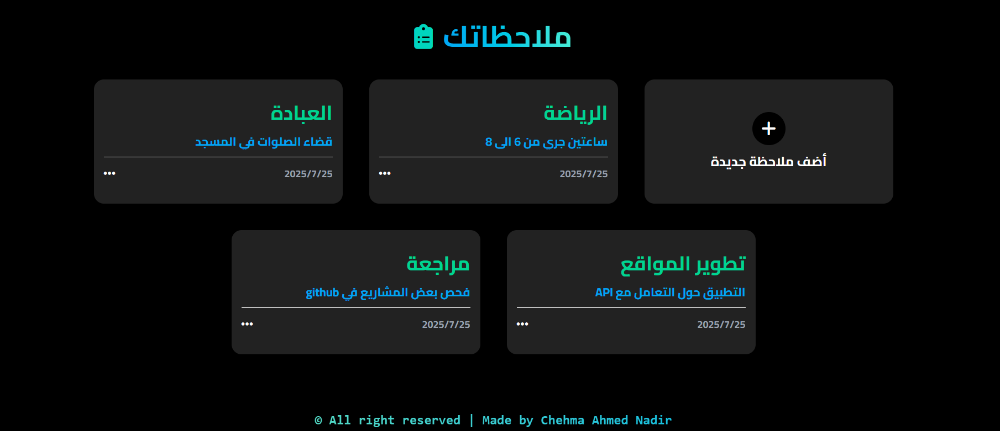

# ✅ To-Do List - قائمة المهام

تطبيق ويب بسيط وأنيق لكتابة الملاحظات باستخدام **HTML**, **Tailwind CSS**, **JavaScript**، مع إضافة بعض التنسيقات المخصصة. يتيح للمستخدمين إمكانية **إضافة**، **تعديل**، و**حذف** الملاحظات بسهولة.

---

## 💻 التقنيات المستخدمة

- ✅ HTML5
- 🎨 Tailwind CSS (باستخدام CDN)
- 🧠 JavaScript (Vanilla)
- 🎧 ملفات صوتية عند الإضافة والحذف
- 🧩 بعض تنسيقات CSS مخصصة

---

## 🎯 الميزات

- ✅ واجهة أنيقة وسهلة الاستخدام.
- ➕ إضافة ملاحظة جديدة تحتوي على عنوان ووصف.
- 🖊️ تعديل الملاحظات السابقة.
- 🗑️ حذف الملاحظات مع تأكيد.
- 🔊 مؤثرات صوتية عند الإضافة والحذف.
- 📱 تصميم متجاوب يعمل على الهواتف والشاشات الصغيرة.

---

